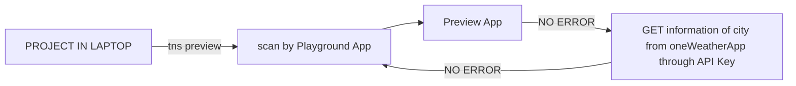

# PROJECT NAME

MINI WEATHER APP
# CONCEPT USED

*ANGULAR
*NATIVE SCRIPT
*API

## PRE-INSTALLATION

Quick Setup In Local System- https://docs.nativescript.org/angular/start/quick-setup

STUDY REFERAL
 quickly get started with CLI Basics-
  https://docs.nativescript.org/angular/start/clibasics

## APPLICATION

-Get The Weather Detail of User Entered City

## REQUIREMENTS

API Key from "OpenWeatherMap API "
IDE like Visual Stdio Code or Run in Cmd

NativeScript APPs:

        -Playground(scan the QR code of Project)
        -Preview(Display the Output App in your Devices)

## INVALID INPUT

If you entered "Invalid City Name".It return Error message in Panel.

## Work Flow

 
